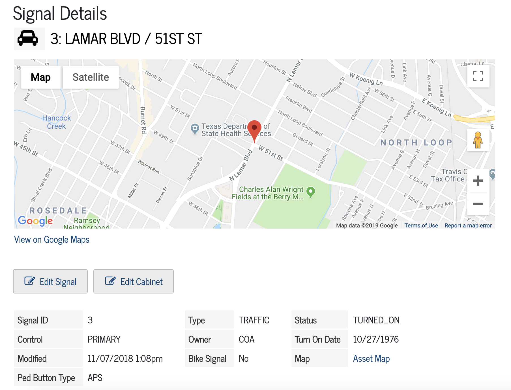

# Data Tracker
The Data Tracker serves as the primary work & asset management system for Austin Transportation. It's powered by [Knack](http://knack.com).

#### Login

[http://transportation.austintexas.io/data-tracker](http://transportation.austintexas.io/data-tracker)

#### Stakeholder Divisions
- Arterial Management
- Signs & Markings
- Right-of-Way

**[Read the docs](https://github.com/cityofaustin/transportation-data-tracker/tree/master/docs)**

